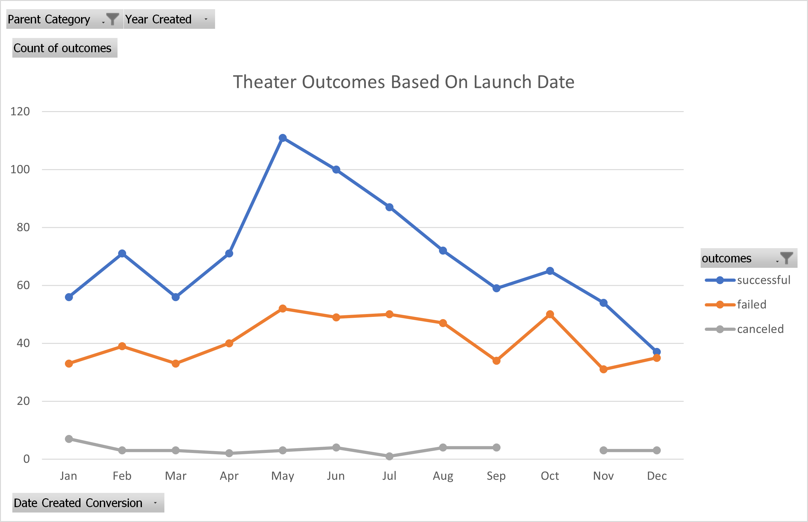
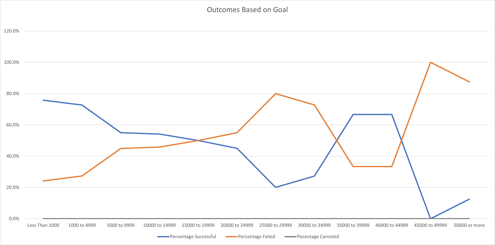

# Kickstarter_Challenge
## Project Overview
The purpose of this challenge was to support our client on the analysis of different Kickstarter campaigns to better support her fundraising efforts.
We were presented with data from over 4000 prior campaigns to analyze and provide meaningful insight about how she can better raise money
## Overview of Analysis
### Theater Campaigns
Our client specifically wanted to know how her theater campaigns performed related to their launch dates.  Dates for each campaign were provided in Unix timestamps so they had to be converted to and Excel format.  Using these dates, we were able to categorized each successful, failed and canceled theater campaign by the start month over several year.  
The resultant trends showed as follows:

The data show a clear trend for successful theater campaigns from May through July.  Not only are more campaigns launched, but the percentage of successful campaigns is higher.  November through January should be avoided as successful campaigns as a percentage of total campaigns trends much lower.
For this campaign, there were no challenges with the data, but it would be interesting to know why donors do not want to donate closer to the end of the calendar year.  Most countries are in the northern hemishpere.  Why are the summer months more attractive for giving to theaters?  What happened with the canceled campaigns, as they were pretty equally distributed throughout the year?
### Play Campaigns
Our client wanted to investigate the relationship between campaign size and success for plays.  
The resultant trends showed as follows:

For plays, the data show that there is a fairly clear trend that campaingns with dontation goals of over 15,000 USD or GBP (of over 1000 campaigns, only 57 were performed in a different currency.)  There were 6 out of 9 campaigns that were successful that were over 35,000, but these seem to be outliers to the total sample.  
To complete this analysis, it would be best to have the dollar exchange rates of the campaigns to present all data in USD.  It would also be best to separate the British campaigns and the US campaigns as they represent the largest samples.  
One challenge in dealing with the data was creating so many CountIFS() entries.  It was too manual and prone to errors.
